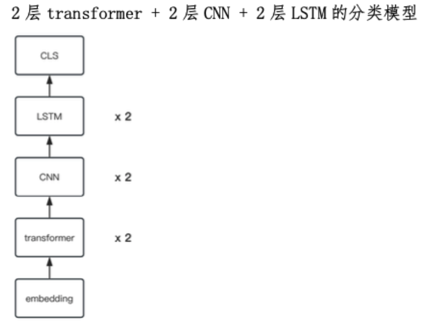

# Chinese-Classify-NLP

A model with an embedding layer, two trasformer layers, two CNN layers, two LSTM layers and a CLS layer to achieve Chinese text classifictaion. 



---
## 代码结构
```
.
├── README.md
├── dataset # 数据集
│   ├── test.tsv
│   ├── train.tsv
│   └── val.tsv
├── demo.py # 运行demo.py，测试模型运行效果
├── f1_test.py # 计算f1分数
├── load_data.py # 加载数据集，创建词表
├── model # 模型权重存放
│   └── model_weights.pth
├── model_template.py # 模型结构
└── train_model.py # 训练模型

```
## 数据集信息

> - Number of rows in train_df: 42346 
> - Number of rows in test_df: 4238 
> - Number of rows in val_df: 4229

```
('train_df', 9, 意图
餐馆       12335
景点       11930
酒店       11132
thank     5320
出租         745
地铁         698
没有意图       169
bye         14
greet        3
Name: count, dtype: int64)
('val_df', 8, 意图
餐馆       1214
景点       1195
酒店       1114
thank     540
出租         81
地铁         68
没有意图       16
bye         1
Name: count, dtype: int64)
('test_df', 8, 意图
餐馆       1268
景点       1171
酒店       1086
thank     529
地铁         84
出租         76
没有意图       23
bye         1
Name: count, dtype: int64)
```
由上述信息可知，数据集中各个种类的占比不平衡，`没有意图`、`bye`、`greet`这三种种类占比过少。其中`greet`甚至都没有被筛选进验证集和测试集。

数据集的分布不平衡会影响模型的训练效果，降低模型预测的准确率。

## 模型训练
```
Epoch 1/1000 - Loss: 1.4971, Accuracy: 0.2825
Validation - Loss: 1.4972, Accuracy: 0.2833
Epoch 2/1000 - Loss: 1.4969, Accuracy: 0.2818
Validation - Loss: 1.5002, Accuracy: 0.2878
Epoch 3/1000 - Loss: 1.4970, Accuracy: 0.2819
Validation - Loss: 1.5006, Accuracy: 0.2878
Epoch 4/1000 - Loss: 1.4965, Accuracy: 0.2861
Validation - Loss: 1.4988, Accuracy: 0.2833
Epoch 5/1000 - Loss: 1.4971, Accuracy: 0.2793
Validation - Loss: 1.4968, Accuracy: 0.2878
Epoch 6/1000 - Loss: 1.4970, Accuracy: 0.2808
Validation - Loss: 1.4974, Accuracy: 0.2878
Epoch 7/1000 - Loss: 1.4965, Accuracy: 0.2833
Validation - Loss: 1.5008, Accuracy: 0.2617
Epoch 8/1000 - Loss: 1.4964, Accuracy: 0.2844
Validation - Loss: 1.4972, Accuracy: 0.2617
Epoch 9/1000 - Loss: 1.4967, Accuracy: 0.2853
Validation - Loss: 1.4966, Accuracy: 0.2878
Epoch 10/1000 - Loss: 1.4959, Accuracy: 0.2857
Validation - Loss: 1.4984, Accuracy: 0.2878
Epoch 11/1000 - Loss: 1.4974, Accuracy: 0.2843
Validation - Loss: 1.5006, Accuracy: 0.2833
Epoch 12/1000 - Loss: 1.4966, Accuracy: 0.2819
Validation - Loss: 1.4989, Accuracy: 0.2833
No improvement in validation accuracy for 10 consecutive epochs, stopping early...
```

- 使用早停机制，在10个epoch后loss没有下降，则停止。
- 使用交叉熵损失（`nn.CrossEntropyLoss()`）作为损失函数，适合多分类问题。
- 使用Adam优化器（optim.Adam）来更新模型的权重。


然而，模型在开始的12的epoch后就停止了，并且，如果取消早停策略，模型后续的训练仍然精度得不到提升，loss得不到下降。

考虑到，是因为设计的模型网络过于复杂，出现欠拟合的问题。

## 测试集上F1分数
```
F1 Macro: 0.05757355612059572, F1 Micro: 0.2991977347805569
```
### 精确率（Precision）和召回率（Recall）

- **精确率**（Precision）是指在所有模型判定为正类的样本中，实际为正类的比例。
  
  $$
  Precision = \frac{TP}{TP + FP}
  $$
  
  其中，$TP$（True Positive）表示真正例的数量，$FP$（False Positive）表示假正例的数量。

- **召回率**（Recall）是指在所有实际为正类的样本中，模型正确判定为正类的比例。
  
  $$
  Recall = \frac{TP}{TP + FN}
  $$
  
  其中，$FN$（False Negative）表示假负例的数量。

### F1分数

- **F1分数**是精确率和召回率的调和平均数：
  
  $$
  F1 = 2 \cdot \frac{Precision \cdot Recall}{Precision + Recall}
  $$
  
  F1分数的值在0到1之间，1表示完美的精确率和召回率，0表示至少有一个是0。

### F1 Macro 和 F1 Micro

- **F1 Macro**计算了所有类别的F1分数的算术平均值。它对所有类别平等对待，无论每个类别的样本数量。因此，在数据不平衡的情况下，少数类的性能对F1 Macro的影响更大。
  
- **F1 Micro**通过累加每个类别的$TP$、$FP$、$FN$来计算总体的精确率和召回率，然后再计算F1分数。它实际上是在所有分类决策上计算F1分数，因此对于每个样本平等对待，适合评估不平衡数据集。

在具体数学表达上，

- **F1 Macro**
  
  $$
  F1_{macro} = \frac{1}{N} \sum_{i=1}^{N} F1_i
  $$
  
  其中，$F1_i$是第$i$个类别的F1分数，$N$是类别的总数。

- **F1 Micro**
  
  $$
  F1_{micro} = 2 \cdot \frac{(\sum TP) \cdot (\sum TP)}{(\sum TP + \sum FP) + (\sum TP + \sum FN)}
  $$

  其中，$\sum TP$、$\sum FP$、$\sum FN$分别表示所有类别中真正例、假正例和假负例的总数。

### 指标分析
- F1 Macro: 0.0576: 分数很低，表明模型在各个类别上的平均性能不好。这可能是训练数据集中`没有意图`、`bye`、`greet`数量过少造成的。

- F1 Micro: 0.2992 - 这个分数虽然比F1 Macro高，但仍然表明模型的整体性能有待提高。由于F1 Micro考虑了样本量，这个更高的分数可能意味着模型在样本量较大的类别上表现得相对较好，但总体来看，性能仍然不是很理想。

## 分析
1. 对于数据集的数据量和文本内容的复杂程度来说，模型的设计过于复杂，可能会造成欠拟合的问题。
2. 设计字符到索引的映射词表时，只采用了最简单的**基于字符分割**的方法，没有按照词语进行分割，从而在捕捉句子语意的能力上较弱。
3. 模型在很长的一段时间内都没有收敛，可能是learning-rate过大，也可能是模型的设计存在根本性错误，需要进一步发现问题。